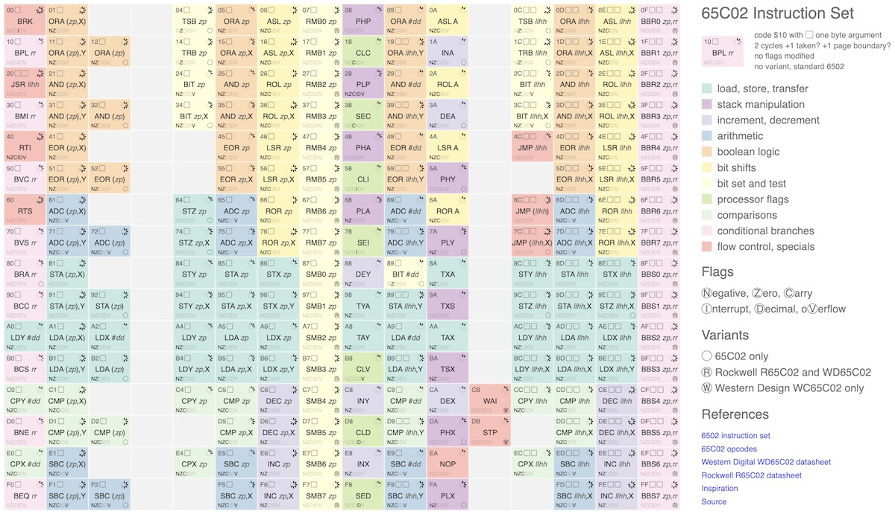

A visual reference to the 65c02 instruction set.

Inspired by https://pastraiser.com/cpu/6502/6502_opcodes.html and implemented with https://d3js.org/

The op code data in `opcodes.json` was scraped from the table above
using `scrape.py` and then augmented with 65c02 instructions based on
http://6502.org/tutorials/65c02opcodes.html

The current version is served at https://patricksurry.github.io/periodic-65c02/ and should look like this:

To serve locally for development,
use `python -m http.server` and browse to http://localhost:8000/opcodes.html
